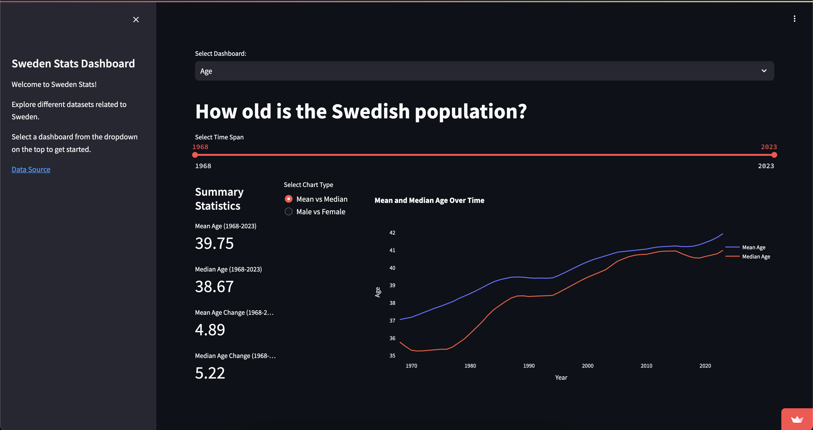
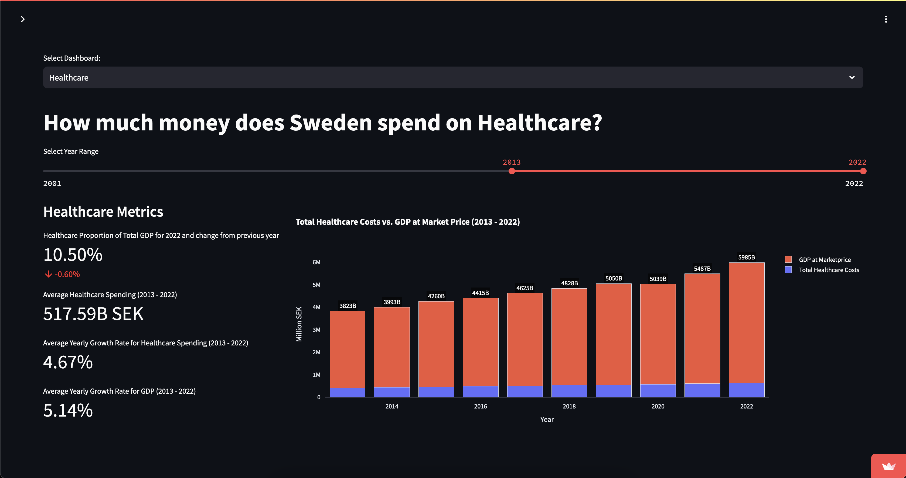
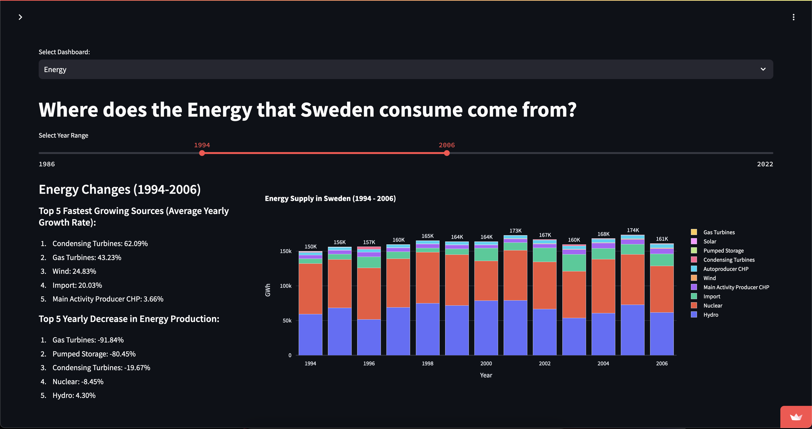
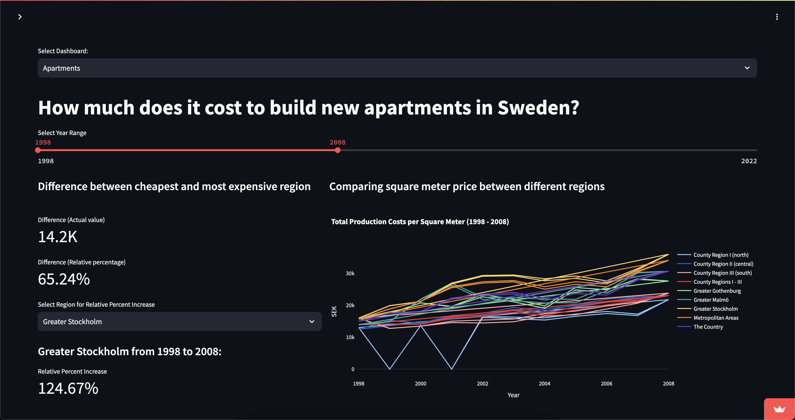

# Sweden Stats Dashboard

## Overview
The Sweden Stats Dashboard is a Streamlit application that visualizes various datasets related to Sweden, including age demographics, healthcare spending, energy consumption, and apartment construction costs. This project aims to provide interactive and insightful visualizations to help users understand trends and patterns in these domains.

## Features
- **Age Demographics**: Explore the age distribution of the Swedish population over time.
- **Healthcare Spending**: Analyze Sweden's healthcare expenditure and its proportion of GDP.
- **Energy Consumption**: Visualize the sources of energy consumed in Sweden and their growth trends.
- **Apartment Construction Costs**: Compare construction costs of new apartments across different regions and time periods.

## Screenshots

### Age Demographics

### Healthcare Spending

### Energy Consumption

### Apartment Construction Costs

## Installation

1. Clone the repository:
   
   git clone https://github.com/getfader/sweden_stats.git
   cd sweden_stats
